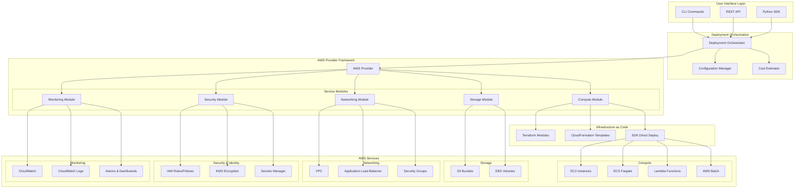
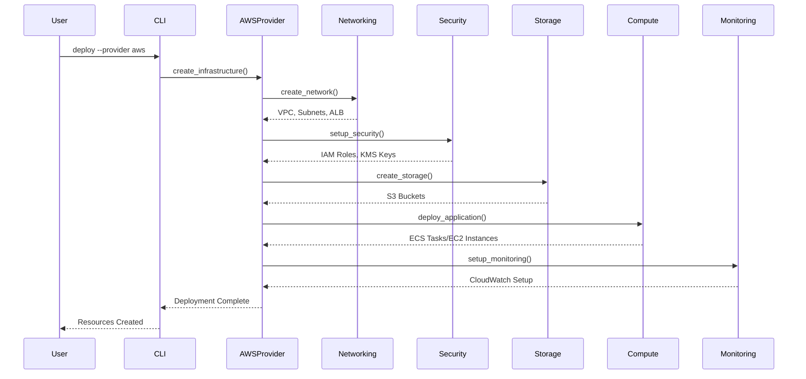
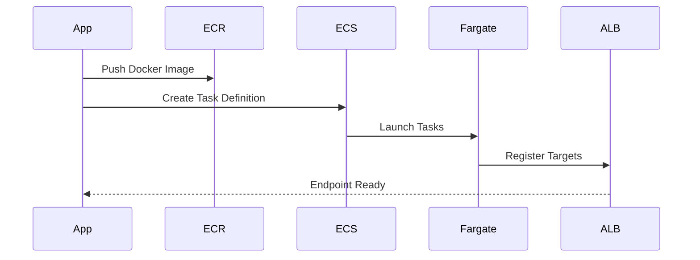
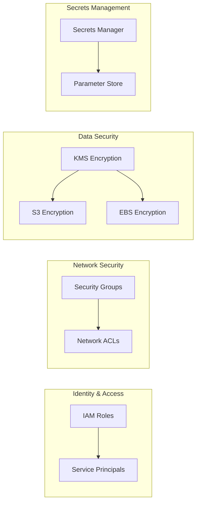
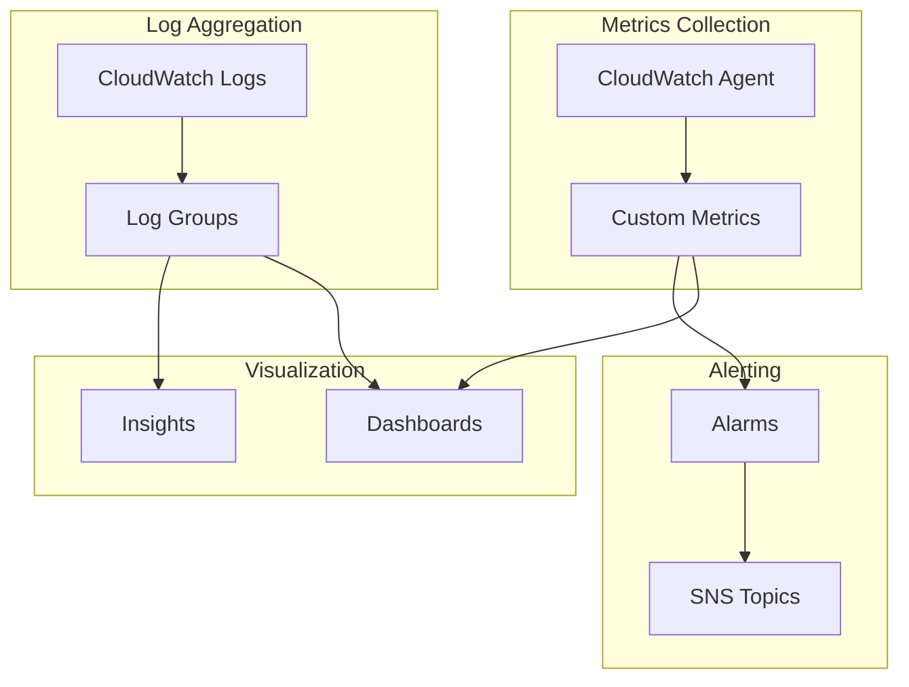
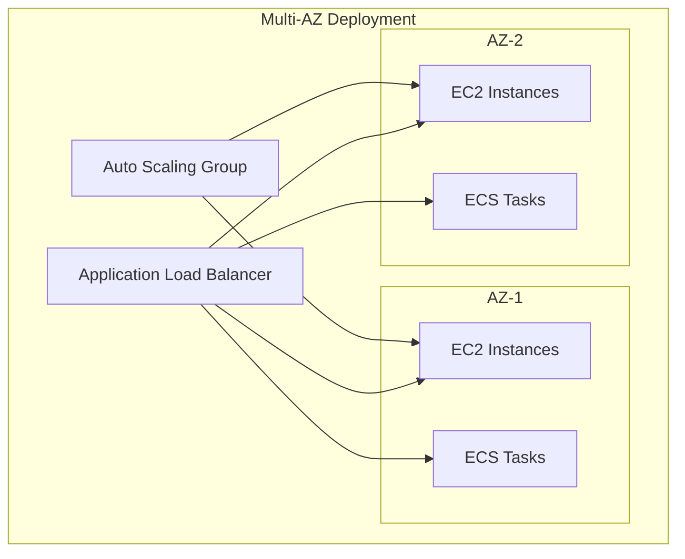

# AWS Deployment Architecture for Inferloop Synthetic Data

## Architecture Overview



## Component Architecture

### 1. AWS Provider Core (`aws/infrastructure/provider.py`)

```python
AWSProvider
├── initialize()           # Setup AWS session and clients
├── create_infrastructure() # Full stack deployment
├── estimate_costs()       # AWS Pricing API integration
└── Service Clients
    ├── EC2 Client
    ├── S3 Client
    ├── ECS Client
    ├── CloudWatch Client
    ├── IAM Client
    └── Pricing Client
```

### 2. Compute Architecture (`aws/infrastructure/compute.py`)

```
Compute Module
├── EC2 Management
│   ├── Instance Creation
│   ├── Auto Scaling Groups
│   └── User Data Scripts
├── Container Services
│   ├── ECS Cluster Management
│   ├── Fargate Task Definitions
│   └── ALB Integration
├── Serverless
│   ├── Lambda Functions
│   └── API Gateway
└── Batch Processing
    ├── Compute Environments
    └── Job Queues
```

### 3. Storage Architecture (`aws/infrastructure/storage.py`)

```
Storage Module
├── S3 Buckets
│   ├── Versioning
│   ├── Encryption
│   └── Lifecycle Policies
└── EBS Volumes
    ├── Volume Management
    ├── Snapshots
    └── Encryption
```

### 4. Networking Architecture (`aws/infrastructure/networking.py`)

```
Networking Module
├── VPC Management
│   ├── Subnet Creation (Public/Private)
│   ├── Route Tables
│   └── Internet Gateway
├── Load Balancing
│   ├── Application Load Balancer
│   ├── Target Groups
│   └── Health Checks
└── Security Groups
    ├── Ingress Rules
    └── Egress Rules
```

## Deployment Flows

### 1. Full Stack Deployment



### 2. Container Deployment Flow



## Resource Organization

### Naming Convention
```
{environment}-{project}-{service}-{resource_type}
Example: prod-inferloop-synthdata-ecs-cluster
```

### Tagging Strategy
```yaml
Tags:
  Environment: prod/staging/dev
  Project: inferloop-synthdata
  ManagedBy: inferloop-infra
  Owner: team-name
  CostCenter: department
  CreatedAt: timestamp
```

## Security Architecture



## Cost Optimization Features

1. **Auto Scaling**
   - Dynamic scaling based on CloudWatch metrics
   - Scheduled scaling for predictable workloads
   - Spot instance integration for cost savings

2. **Resource Lifecycle**
   - Automated stop/start schedules
   - S3 lifecycle policies
   - EBS snapshot management

3. **Cost Estimation**
   - Pre-deployment cost calculation
   - Resource tagging for cost allocation
   - Budget alerts via CloudWatch

## Monitoring & Observability



## High Availability Architecture



## Integration Points

### 1. With Synthetic Data SDK
- Containerized application deployment
- S3 integration for data storage
- Batch processing for large datasets

### 2. Multi-Cloud Strategy
- Common abstraction layer
- Cross-cloud resource mapping
- Unified configuration format

### 3. CI/CD Integration
- GitOps-friendly Terraform modules
- CloudFormation stack updates
- Blue-green deployments

## Implementation Status

### ✅ Fully Implemented
- EC2 instance management
- ECS/Fargate container deployment
- S3 bucket creation and management
- VPC and networking setup
- IAM role and policy management
- CloudWatch monitoring
- Cost estimation
- Auto-scaling configuration

### ⚠️ Partially Implemented
- Lambda function deployment (basic support)
- Route53 DNS management (planned)
- RDS database integration (uses IAM placeholders)

### 🔄 Integration Needed
- CLI command integration
- Multi-environment configuration templates
- Deployment validation tests

## Usage Examples

### Deploy Full Stack
```bash
inferloop-synthetic deploy \
  --provider aws \
  --region us-east-1 \
  --environment production \
  --config aws-config.yaml
```

### Deploy Container Application
```bash
inferloop-synthetic deploy-container \
  --provider aws \
  --image inferloop/synthdata:latest \
  --cpu 2048 \
  --memory 4096 \
  --replicas 3
```

### Estimate Costs
```bash
inferloop-synthetic estimate-costs \
  --provider aws \
  --config aws-config.yaml
```

## Best Practices

1. **Security**
   - Enable encryption for all storage
   - Use IAM roles instead of keys
   - Implement least privilege access
   - Enable VPC flow logs

2. **Cost Management**
   - Use spot instances for batch jobs
   - Implement auto-scaling
   - Set up budget alerts
   - Tag all resources

3. **Reliability**
   - Deploy across multiple AZs
   - Configure health checks
   - Implement automated backups
   - Use immutable infrastructure

4. **Performance**
   - Right-size instances
   - Use CDN for static content
   - Optimize container images
   - Monitor and tune regularly