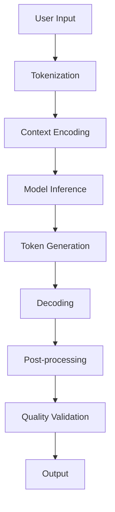

# How Synthetic Text Data is Generated

## Overview

The TextNLP synthetic data generation system uses state-of-the-art language models and advanced techniques to create high-quality synthetic text and NLP data. This document explains the underlying mechanisms, models, and processes used to generate synthetic data.

## Table of Contents

1. [Core Generation Process](#core-generation-process)
2. [Language Models](#language-models)
3. [Generation Techniques](#generation-techniques)
4. [Quality Control](#quality-control)
5. [Architecture Overview](#architecture-overview)

## Core Generation Process

### 1. Input Processing

The generation process begins with understanding the user's requirements:

```
User Input → Context Analysis → Model Selection → Parameter Configuration → Generation
```

#### Input Types:
- **Prompts**: Direct text prompts for continuation or completion
- **Templates**: Structured templates with variables for consistent generation
- **Examples**: Few-shot learning with provided examples
- **Constraints**: Specific requirements (length, style, format)

### 2. Model Selection

Based on the input and requirements, the system selects the appropriate model:

```python
# Model selection logic
if task_type == "general_text":
    model = "gpt2-large"
elif task_type == "long_form":
    model = "gpt2-xl"
elif task_type == "specialized":
    model = "gpt-j-6b"
elif task_type == "multilingual":
    model = "llama-7b"
```

### 3. Generation Pipeline



## Language Models

### Available Models

#### 1. GPT-2 Family
- **GPT-2 Base (124M)**: Fast, general-purpose text generation
- **GPT-2 Medium (355M)**: Better quality with moderate speed
- **GPT-2 Large (774M)**: High-quality generation for complex tasks
- **GPT-2 XL (1.5B)**: Premium quality for demanding applications

#### 2. Advanced Models
- **GPT-J-6B**: Large-scale model for sophisticated generation
- **LLaMA-7B**: Multi-lingual and specialized content
- **Commercial Models**: GPT-4, Claude (Enterprise tier)

### Model Characteristics

| Model | Parameters | Best For | Speed | Quality |
|-------|------------|----------|-------|---------|
| GPT-2 | 124M | Quick prototypes | ⚡⚡⚡⚡⚡ | ⭐⭐⭐ |
| GPT-2-Large | 774M | Balanced tasks | ⚡⚡⚡ | ⭐⭐⭐⭐ |
| GPT-J-6B | 6B | Complex generation | ⚡⚡ | ⭐⭐⭐⭐⭐ |
| LLaMA-7B | 7B | Multilingual | ⚡⚡ | ⭐⭐⭐⭐⭐ |

## Generation Techniques

### 1. Autoregressive Generation

The core technique uses autoregressive language modeling:

```python
def generate_text(prompt, model, max_length=100):
    tokens = tokenize(prompt)
    
    for _ in range(max_length):
        # Predict next token
        logits = model(tokens)
        next_token = sample_from_logits(logits)
        
        # Append to sequence
        tokens.append(next_token)
        
        # Check stopping criteria
        if is_end_token(next_token):
            break
    
    return decode(tokens)
```

### 2. Sampling Strategies

#### Temperature Sampling
Controls randomness in generation:
- **Low temperature (0.1-0.5)**: Conservative, predictable
- **Medium temperature (0.7-0.8)**: Balanced creativity
- **High temperature (0.9-1.5)**: Creative, diverse

```python
def temperature_sampling(logits, temperature=0.7):
    scaled_logits = logits / temperature
    probabilities = softmax(scaled_logits)
    return sample_from_distribution(probabilities)
```

#### Top-k Sampling
Limits vocabulary to top k most likely tokens:

```python
def top_k_sampling(logits, k=50):
    top_k_logits, top_k_indices = torch.topk(logits, k)
    probabilities = softmax(top_k_logits)
    selected_index = sample_from_distribution(probabilities)
    return top_k_indices[selected_index]
```

#### Top-p (Nucleus) Sampling
Dynamic vocabulary based on cumulative probability:

```python
def top_p_sampling(logits, p=0.9):
    sorted_logits, sorted_indices = torch.sort(logits, descending=True)
    cumulative_probs = torch.cumsum(softmax(sorted_logits), dim=-1)
    
    # Find cutoff
    sorted_indices_to_remove = cumulative_probs > p
    sorted_logits[sorted_indices_to_remove] = -float('inf')
    
    return sample_from_distribution(softmax(sorted_logits))
```

### 3. Advanced Techniques

#### Beam Search
Explores multiple generation paths:

```python
def beam_search(prompt, model, beam_width=5):
    beams = [(prompt, 0.0)]  # (sequence, score)
    
    for step in range(max_length):
        candidates = []
        
        for sequence, score in beams:
            logits = model(sequence)
            top_tokens = get_top_k_tokens(logits, beam_width)
            
            for token, token_score in top_tokens:
                new_sequence = sequence + [token]
                new_score = score + token_score
                candidates.append((new_sequence, new_score))
        
        # Keep top beams
        beams = sorted(candidates, key=lambda x: x[1])[:beam_width]
    
    return beams[0][0]  # Best sequence
```

#### Constrained Generation
Enforces specific patterns or formats:

```python
def constrained_generation(prompt, constraints):
    """
    Constraints can include:
    - max_length: Maximum number of tokens
    - min_length: Minimum number of tokens
    - must_include: Words that must appear
    - forbidden_words: Words to avoid
    - format_regex: Pattern to match
    """
    generated = generate_with_model(prompt)
    
    # Apply constraints
    if not meets_constraints(generated, constraints):
        generated = regenerate_with_constraints(prompt, constraints)
    
    return generated
```

### 4. Template-Based Generation

Using LangChain for structured generation:

```python
from langchain import PromptTemplate

template = PromptTemplate(
    input_variables=["product", "audience"],
    template="""
    Write a marketing email for {product} targeting {audience}.
    
    Subject: [Generate compelling subject]
    
    Body:
    [Generate engaging email content]
    
    Call to Action: [Generate CTA]
    """
)

# Generate with template
result = chain.run(product="AI Writing Assistant", audience="content creators")
```

## Quality Control

### 1. Real-time Validation

During generation, the system performs:

- **Coherence Checking**: Ensures logical flow
- **Grammar Validation**: Checks syntactic correctness
- **Relevance Scoring**: Measures alignment with prompt
- **Toxicity Filtering**: Removes harmful content

### 2. Post-Generation Validation

#### BLEU Score Calculation
Measures similarity to reference texts:

```python
def calculate_bleu(generated, references):
    from nltk.translate.bleu_score import sentence_bleu
    
    generated_tokens = tokenize(generated)
    reference_tokens = [tokenize(ref) for ref in references]
    
    # Calculate BLEU-1 to BLEU-4
    bleu_scores = []
    for n in range(1, 5):
        weights = [1/n] * n + [0] * (4-n)
        score = sentence_bleu(reference_tokens, generated_tokens, weights)
        bleu_scores.append(score)
    
    return {
        'bleu_1': bleu_scores[0],
        'bleu_2': bleu_scores[1],
        'bleu_3': bleu_scores[2],
        'bleu_4': bleu_scores[3],
        'average': sum(bleu_scores) / 4
    }
```

#### ROUGE Score Calculation
Evaluates recall-based similarity:

```python
def calculate_rouge(generated, references):
    from rouge import Rouge
    
    rouge = Rouge()
    scores = rouge.get_scores(generated, references[0])
    
    return {
        'rouge_1': scores[0]['rouge-1']['f'],
        'rouge_2': scores[0]['rouge-2']['f'],
        'rouge_l': scores[0]['rouge-l']['f']
    }
```

### 3. Human-in-the-Loop Validation

For critical applications:

1. **Initial Generation**: AI creates candidates
2. **Human Review**: Expert evaluation
3. **Feedback Integration**: Refinement based on feedback
4. **Final Validation**: Quality assurance

## Architecture Overview

### System Components

```
┌─────────────────────────────────────────────────────────────┐
│                     TextNLP System                          │
├─────────────────────────────────────────────────────────────┤
│  Generation Pipeline                                        │
│  ┌─────────────┐  ┌─────────────┐  ┌─────────────┐      │
│  │   Input     │  │   Model     │  │   Output    │      │
│  │ Processing  │→ │  Inference  │→ │ Generation  │      │
│  └─────────────┘  └─────────────┘  └─────────────┘      │
├─────────────────────────────────────────────────────────────┤
│  Model Management                                           │
│  ┌─────────────┐  ┌─────────────┐  ┌─────────────┐      │
│  │   Model     │  │   Model     │  │   Model     │      │
│  │   Cache     │  │   Loading   │  │ Optimization│      │
│  └─────────────┘  └─────────────┘  └─────────────┘      │
├─────────────────────────────────────────────────────────────┤
│  Quality Assurance                                          │
│  ┌─────────────┐  ┌─────────────┐  ┌─────────────┐      │
│  │ Validation  │  │   Metrics   │  │  Feedback   │      │
│  │   Engine    │  │ Calculation │  │ Integration │      │
│  └─────────────┘  └─────────────┘  └─────────────┘      │
└─────────────────────────────────────────────────────────────┘
```

### Generation Flow

```python
class TextGenerator:
    def __init__(self, model_name="gpt2-large"):
        self.model = load_model(model_name)
        self.tokenizer = load_tokenizer(model_name)
        self.validator = TextValidator()
    
    async def generate(self, prompt, **kwargs):
        # 1. Preprocess input
        processed_prompt = self.preprocess(prompt)
        
        # 2. Tokenize
        input_ids = self.tokenizer.encode(processed_prompt)
        
        # 3. Generate
        with torch.no_grad():
            output_ids = self.model.generate(
                input_ids,
                max_length=kwargs.get('max_length', 100),
                temperature=kwargs.get('temperature', 0.7),
                top_p=kwargs.get('top_p', 0.9),
                top_k=kwargs.get('top_k', 50),
                do_sample=True
            )
        
        # 4. Decode
        generated_text = self.tokenizer.decode(output_ids[0])
        
        # 5. Post-process
        cleaned_text = self.postprocess(generated_text)
        
        # 6. Validate
        validation_results = await self.validator.validate(cleaned_text)
        
        return {
            'text': cleaned_text,
            'validation': validation_results,
            'metadata': {
                'model': model_name,
                'parameters': kwargs,
                'timestamp': datetime.utcnow()
            }
        }
```

## Best Practices

### 1. Prompt Engineering

- **Be Specific**: Clear, detailed prompts yield better results
- **Provide Context**: Include relevant background information
- **Use Examples**: Few-shot learning improves quality
- **Set Constraints**: Define length, style, format requirements

### 2. Parameter Tuning

- **Start Conservative**: Begin with lower temperature values
- **Iterate**: Adjust based on output quality
- **Balance**: Trade-off between creativity and coherence
- **Test**: Validate with your specific use case

### 3. Quality Assurance

- **Always Validate**: Use automated metrics
- **Human Review**: For critical applications
- **Iterate**: Refine based on feedback
- **Monitor**: Track quality over time

## Conclusion

The TextNLP synthetic data generation system combines advanced language models with sophisticated generation techniques to produce high-quality synthetic text. By understanding these mechanisms, users can better leverage the system for their specific needs and achieve optimal results.