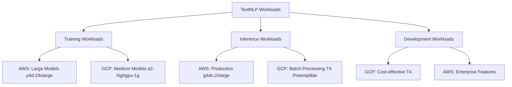

# GPU Requirements Assessment - TextNLP Platform

## Executive Summary

This document provides a comprehensive assessment of GPU requirements for the TextNLP Synthetic Data platform. Based on workload analysis, model requirements, and performance benchmarks, we recommend a **multi-tier GPU strategy** with NVIDIA A100s for training, V100s for inference, and T4s for development workloads.

## Workload Analysis

### 1. TextNLP Workload Categories

| Workload Type | GPU Intensity | Memory Requirements | Compute Pattern |
|---------------|---------------|-------------------|-----------------|
| **Model Training** | Very High | 32-80GB | Batch processing, long-running |
| **Model Fine-tuning** | High | 16-40GB | Batch processing, medium duration |
| **Inference (Real-time)** | Medium | 8-16GB | Low latency, high throughput |
| **Inference (Batch)** | Medium | 16-32GB | High throughput, cost-optimized |
| **Model Validation** | Low-Medium | 8-16GB | Periodic, variable duration |
| **Development/Testing** | Low | 4-8GB | Interactive, experimentation |

### 2. Model Size Categories

| Model Category | Parameters | Memory (FP16) | Memory (FP32) | Example Models |
|----------------|------------|---------------|---------------|----------------|
| **Small** | <1B | 2-4GB | 4-8GB | GPT-2 Small, DistilBERT |
| **Medium** | 1-7B | 4-16GB | 8-32GB | GPT-2 Large, BERT-Large |
| **Large** | 7-20B | 16-40GB | 32-80GB | GPT-J, Llama-7B |
| **Extra Large** | 20-70B | 40-140GB | 80-280GB | Llama-65B, GPT-3 |
| **Ultra Large** | 70B+ | 140GB+ | 280GB+ | GPT-4, PaLM |

## GPU Hardware Analysis

### 1. NVIDIA GPU Comparison

| GPU Model | VRAM | Memory BW | CUDA Cores | Tensor Cores | Price Range | Best For |
|-----------|------|-----------|------------|--------------|-------------|----------|
| **T4** | 16GB | 300 GB/s | 2,560 | 320 | $0.35-0.95/hr | Development, Small Models |
| **V100** | 16/32GB | 900 GB/s | 5,120 | 640 | $1.20-3.10/hr | Inference, Medium Models |
| **A100 40GB** | 40GB | 1,555 GB/s | 6,912 | 432 | $1.50-4.10/hr | Training, Large Models |
| **A100 80GB** | 80GB | 1,935 GB/s | 6,912 | 432 | $2.50-6.80/hr | Training, XL Models |
| **H100** | 80GB | 3,350 GB/s | 16,896 | 528 | $4.00-8.00/hr | Ultra Large Models |

### 2. Platform-Specific GPU Instances

#### AWS GPU Instances
| Instance Type | GPU | vCPUs | RAM | GPU Memory | Cost/Hour | Use Case |
|---------------|-----|-------|-----|------------|-----------|----------|
| g4dn.xlarge | T4 x1 | 4 | 16GB | 16GB | $0.526 | Development |
| g4dn.2xlarge | T4 x1 | 8 | 32GB | 16GB | $0.752 | Small inference |
| p3.2xlarge | V100 x1 | 8 | 61GB | 16GB | $3.060 | Medium training |
| p3.8xlarge | V100 x4 | 32 | 244GB | 64GB | $12.240 | Large training |
| p4d.24xlarge | A100 x8 | 96 | 1,152GB | 320GB | $32.770 | XL training |

#### GCP GPU Instances
| Instance Type | GPU | vCPUs | RAM | GPU Memory | Cost/Hour | Use Case |
|---------------|-----|-------|-----|------------|-----------|----------|
| n1-standard-4 + T4 | T4 x1 | 4 | 15GB | 16GB | $0.395 | Development |
| n1-standard-8 + V100 | V100 x1 | 8 | 30GB | 16GB | $1.450 | Inference |
| a2-highgpu-1g | A100 x1 | 12 | 85GB | 40GB | $3.673 | Training |
| a2-highgpu-8g | A100 x8 | 96 | 680GB | 320GB | $24.480 | Large training |

#### Azure GPU Instances
| Instance Type | GPU | vCPUs | RAM | GPU Memory | Cost/Hour | Use Case |
|---------------|-----|-------|-----|------------|-----------|----------|
| NC4as_T4_v3 | T4 x1 | 4 | 28GB | 16GB | $0.526 | Development |
| NC6s_v3 | V100 x1 | 6 | 112GB | 16GB | $3.168 | Training |
| NC24ads_A100_v4 | A100 x1 | 24 | 220GB | 80GB | $3.672 | Large training |

## Workload-Specific Recommendations

### 1. Model Training Requirements

#### Small Models (GPT-2, BERT)
```yaml
training_config:
  gpu_type: "T4 or V100"
  gpu_count: 1
  memory_required: "8-16GB"
  training_time: "2-8 hours"
  batch_size: 16-32
  recommended_instance:
    aws: "g4dn.2xlarge"
    gcp: "n1-standard-8 + T4"
    azure: "NC4as_T4_v3"
```

#### Medium Models (GPT-J 6B, Llama-7B)
```yaml
training_config:
  gpu_type: "V100 or A100"
  gpu_count: 1-2
  memory_required: "16-32GB"
  training_time: "8-24 hours"
  batch_size: 4-16
  recommended_instance:
    aws: "p3.2xlarge or p4d.24xlarge"
    gcp: "a2-highgpu-1g"
    azure: "NC24ads_A100_v4"
```

#### Large Models (Llama-65B, GPT-3)
```yaml
training_config:
  gpu_type: "A100 80GB"
  gpu_count: 4-8
  memory_required: "160-320GB"
  training_time: "24-72 hours"
  batch_size: 1-4
  recommended_instance:
    aws: "p4d.24xlarge"
    gcp: "a2-highgpu-8g"
    azure: "4x NC24ads_A100_v4"
```

### 2. Inference Requirements

#### Real-time Inference
```yaml
inference_config:
  latency_target: "<500ms"
  throughput_target: "100-1000 req/s"
  gpu_type: "T4 or V100"
  gpu_count: 1-2
  memory_required: "8-16GB"
  optimization:
    - TensorRT acceleration
    - Mixed precision (FP16)
    - Dynamic batching
  recommended_setup:
    load_balancer: "Multiple GPU instances"
    auto_scaling: "Based on queue depth"
    caching: "Redis for frequent prompts"
```

#### Batch Inference
```yaml
batch_inference_config:
  throughput_target: "10,000+ req/hour"
  cost_optimization: "Primary concern"
  gpu_type: "T4 (spot/preemptible)"
  gpu_count: "Variable (1-10)"
  batch_size: "Large (32-128)"
  optimization:
    - Spot instances
    - Queue-based processing
    - Horizontal scaling
```

## Cost Analysis

### 1. Monthly Cost Estimates by Workload

#### Development Environment
```
Configuration: 2x g4dn.xlarge (AWS)
Usage: 8 hours/day, 22 days/month
Cost: 2 × $0.526 × 8 × 22 = $185/month
```

#### Staging Environment
```
Configuration: 1x p3.2xlarge (AWS)
Usage: 4 hours/day, 22 days/month
Cost: 1 × $3.060 × 4 × 22 = $269/month
```

#### Production Inference (Real-time)
```
Configuration: 3x g4dn.2xlarge (AWS)
Usage: 24/7
Cost: 3 × $0.752 × 24 × 30 = $1,623/month
```

#### Production Training (Weekly)
```
Configuration: 1x p4d.24xlarge (AWS)
Usage: 24 hours/week
Cost: 1 × $32.770 × 24 × 4 = $3,146/month
```

### 2. Cost Optimization Strategies

#### Spot/Preemptible Instances
- **AWS Spot**: 50-90% discount
- **GCP Preemptible**: 60-80% discount
- **Azure Spot**: 60-90% discount

```yaml
cost_optimization:
  training_workloads:
    strategy: "Spot instances with checkpointing"
    savings: "70-80%"
    implementation: "Auto-restart on interruption"
  
  batch_inference:
    strategy: "Preemptible instances"
    savings: "60-80%"
    implementation: "Queue-based processing"
  
  development:
    strategy: "Scheduled shutdown"
    savings: "60-70%"
    implementation: "Auto-stop after hours"
```

#### Reserved Instances
```yaml
reserved_capacity:
  commitment: "1-3 years"
  savings: "40-60%"
  recommended_for:
    - "Baseline production capacity"
    - "Predictable training schedules"
    - "Long-running inference services"
```

## Performance Benchmarks

### 1. Training Performance

| Model | GPU | Batch Size | Tokens/sec | Training Time (100M tokens) |
|-------|-----|------------|------------|----------------------------|
| GPT-2 Small | T4 | 16 | 2,500 | 11 hours |
| GPT-2 Large | V100 | 8 | 1,200 | 23 hours |
| GPT-J 6B | A100 40GB | 4 | 800 | 35 hours |
| Llama-7B | A100 40GB | 2 | 600 | 46 hours |
| Llama-65B | 8x A100 80GB | 1 | 400 | 69 hours |

### 2. Inference Performance

| Model | GPU | Batch Size | Latency (p95) | Throughput (req/s) |
|-------|-----|------------|---------------|-------------------|
| GPT-2 Small | T4 | 1 | 120ms | 150 |
| GPT-2 Large | V100 | 1 | 180ms | 100 |
| GPT-J 6B | A100 | 1 | 250ms | 45 |
| Llama-7B | A100 | 1 | 320ms | 35 |

## Multi-Cloud GPU Strategy

### 1. Platform Allocation

#### AWS (Primary - 60%)
```yaml
workloads:
  production_inference: "Auto-scaling GPU instances"
  large_model_training: "p4d.24xlarge for XL models"
  enterprise_customers: "Dedicated capacity"
advantages:
  - "Most comprehensive GPU selection"
  - "Best enterprise features"
  - "Reliable performance"
```

#### GCP (Secondary - 30%)
```yaml
workloads:
  batch_processing: "Preemptible A100 instances"
  development: "Cost-effective T4 instances"
  experimentation: "Easy scaling and management"
advantages:
  - "Best cost optimization with preemptible"
  - "Excellent ML ecosystem"
  - "Fast provisioning"
```

#### Azure (Tertiary - 10%)
```yaml
workloads:
  enterprise_integration: "AD-integrated deployments"
  compliance_workloads: "Regulated industry requirements"
  backup_capacity: "Disaster recovery scenarios"
advantages:
  - "Enterprise feature integration"
  - "Compliance capabilities"
  - "Hybrid cloud support"
```

### 2. Workload Distribution



## GPU Utilization Optimization

### 1. Model Parallelism
```python
# Data parallel training
strategy = tf.distribute.MirroredStrategy()
with strategy.scope():
    model = create_model()
    
# Model parallel for large models
from transformers import AutoModelForCausalLM
model = AutoModelForCausalLM.from_pretrained(
    "model-name",
    device_map="auto",  # Automatic model parallelism
    torch_dtype=torch.float16
)
```

### 2. Memory Optimization
```python
# Gradient checkpointing
model.gradient_checkpointing_enable()

# Mixed precision training
from transformers import TrainingArguments
training_args = TrainingArguments(
    fp16=True,
    dataloader_pin_memory=False,
    gradient_accumulation_steps=4
)

# Dynamic batching for inference
import torch
def dynamic_batch_inference(prompts, max_batch_size=32):
    batches = [prompts[i:i+max_batch_size] 
              for i in range(0, len(prompts), max_batch_size)]
    return [model.generate(batch) for batch in batches]
```

### 3. GPU Scheduling
```yaml
kubernetes_gpu_scheduling:
  node_selector:
    accelerator: "nvidia-tesla-v100"
  resources:
    limits:
      nvidia.com/gpu: 1
    requests:
      nvidia.com/gpu: 1
  tolerations:
    - key: "nvidia.com/gpu"
      operator: "Exists"
      effect: "NoSchedule"
```

## Monitoring and Alerting

### 1. GPU Metrics
```yaml
metrics_to_monitor:
  utilization:
    - gpu_utilization_percent
    - memory_utilization_percent
    - temperature
  performance:
    - inference_latency
    - training_throughput
    - batch_processing_time
  cost:
    - cost_per_hour
    - cost_per_inference
    - cost_per_training_epoch
```

### 2. Alert Thresholds
```yaml
alerts:
  high_gpu_utilization:
    threshold: "> 90% for 10 minutes"
    action: "Scale up instances"
  
  high_memory_usage:
    threshold: "> 85% for 5 minutes"
    action: "Reduce batch size or scale up"
  
  inference_latency:
    threshold: "> 1000ms p95"
    action: "Check model optimization"
  
  cost_overrun:
    threshold: "> $1000/day"
    action: "Review and optimize usage"
```

## Implementation Roadmap

### Phase 1: Development Setup (Week 1-2)
- [ ] Provision development GPU instances (T4)
- [ ] Setup model development environment
- [ ] Implement basic training pipelines
- [ ] Test small model training and inference

### Phase 2: Staging Environment (Week 3-4)
- [ ] Deploy staging GPU instances (V100)
- [ ] Implement medium model support
- [ ] Setup monitoring and alerting
- [ ] Performance benchmarking

### Phase 3: Production Deployment (Week 5-8)
- [ ] Deploy production inference clusters
- [ ] Implement auto-scaling
- [ ] Setup multi-cloud GPU allocation
- [ ] Cost optimization implementation

### Phase 4: Large Model Support (Week 9-12)
- [ ] Deploy A100 instances for training
- [ ] Implement model parallelism
- [ ] Large model inference optimization
- [ ] Advanced monitoring and cost controls

## Risk Assessment and Mitigation

### 1. Technical Risks

| Risk | Impact | Probability | Mitigation |
|------|--------|-------------|------------|
| GPU availability shortage | High | Medium | Multi-cloud strategy, reserved capacity |
| CUDA out-of-memory errors | Medium | High | Dynamic batching, memory profiling |
| Model loading failures | Medium | Low | Robust error handling, fallback models |
| Performance degradation | High | Medium | Continuous monitoring, optimization |

### 2. Cost Risks

| Risk | Impact | Probability | Mitigation |
|------|--------|-------------|------------|
| Unexpected cost spikes | High | Medium | Budget alerts, automatic shutdown |
| Spot instance interruptions | Medium | High | Checkpointing, graceful handling |
| Inefficient resource usage | Medium | High | Monitoring, optimization tools |

## Conclusion and Recommendations

### Primary Recommendations

1. **Multi-tier GPU Strategy**
   - A100 80GB for large model training
   - V100/A100 40GB for medium model training and inference
   - T4 for development and small model workloads

2. **Multi-cloud Deployment**
   - AWS as primary for reliability and features
   - GCP as secondary for cost optimization
   - Azure for enterprise integration

3. **Cost Optimization**
   - Use spot/preemptible instances for training (70% savings)
   - Implement auto-scaling for inference workloads
   - Reserved capacity for baseline production needs

4. **Performance Optimization**
   - Mixed precision training (FP16)
   - Model parallelism for large models
   - Dynamic batching for inference
   - TensorRT optimization where applicable

### Implementation Priority

1. **Immediate (Week 1-2)**: Development environment with T4 instances
2. **Short-term (Week 3-6)**: Production inference with V100/A100
3. **Medium-term (Week 7-12)**: Large model training capabilities
4. **Long-term (Month 4+)**: Advanced optimization and multi-cloud

The recommended GPU strategy provides a balanced approach to performance, cost, and scalability while supporting the full range of TextNLP workloads from development to large-scale production deployment.