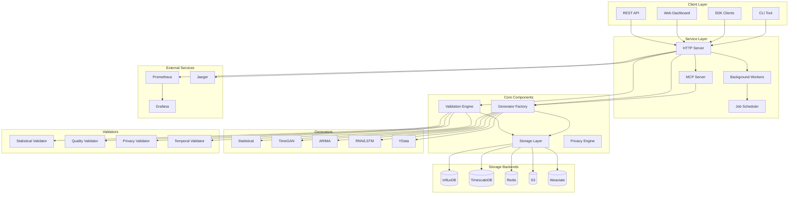
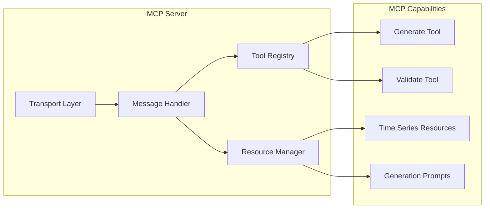
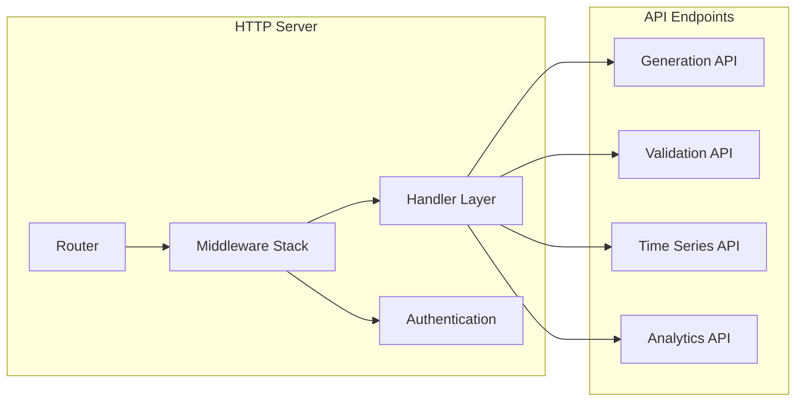
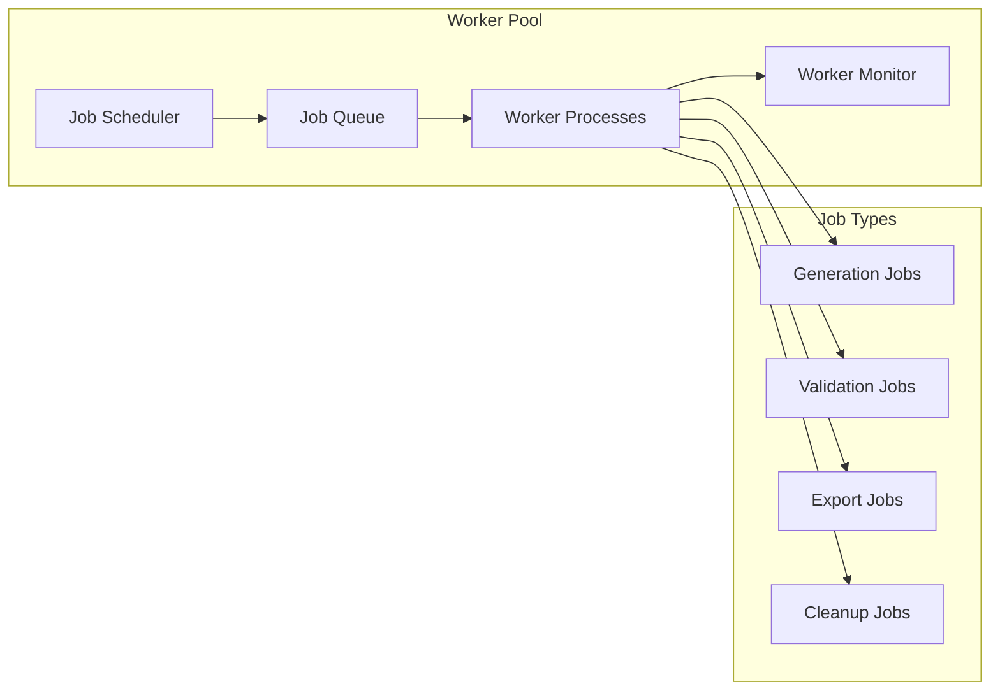
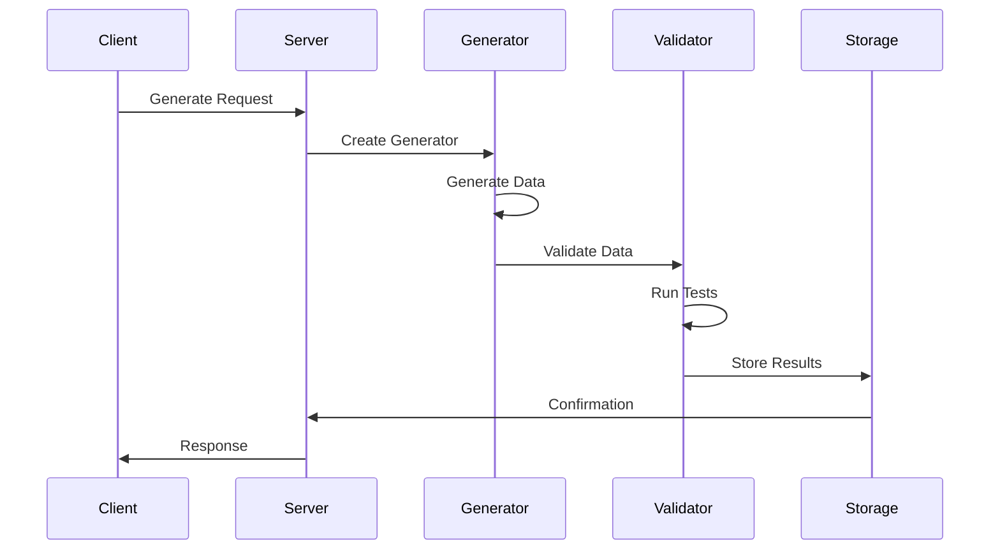
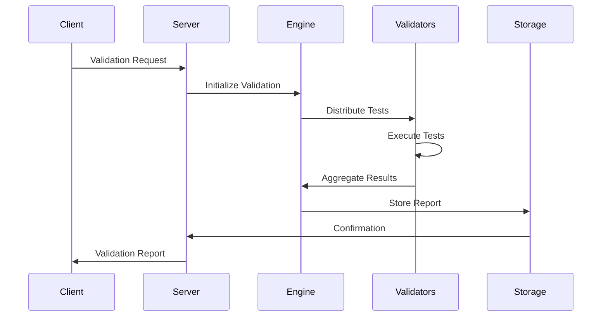
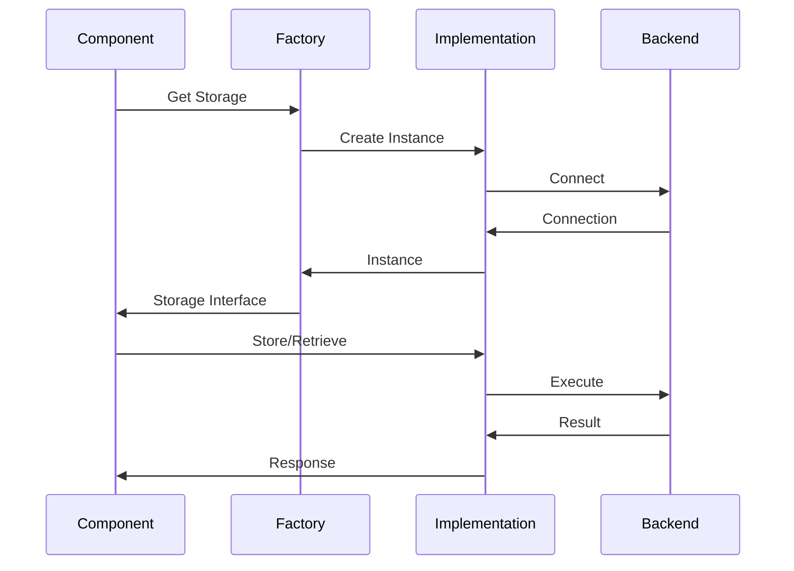

# TSIOT Architecture Overview

This document provides a comprehensive overview of the TSIOT (Time Series IoT Synthetic Data) system architecture.

## System Overview

TSIOT is a microservices-based platform designed for generating, validating, and managing synthetic time series data. The system follows a modular architecture with clear separation of concerns and supports multiple deployment patterns.

## High-Level Architecture



## Core Architectural Principles

### 1. Microservices Architecture
- **Separation of Concerns**: Each service has a single responsibility
- **Independent Deployment**: Services can be deployed and scaled independently
- **Technology Diversity**: Different services can use different technologies
- **Fault Isolation**: Failure in one service doesn't affect others

### 2. Plugin-based Design
- **Extensibility**: New generators and validators can be added without core changes
- **Interface-driven**: All plugins implement well-defined interfaces
- **Dynamic Loading**: Plugins can be loaded at runtime
- **Configuration-driven**: Plugin behavior controlled through configuration

### 3. Event-driven Architecture
- **Asynchronous Processing**: Long-running tasks handled asynchronously
- **Message Queues**: Reliable message passing between services
- **Event Sourcing**: System state changes captured as events
- **Reactive Systems**: Components react to state changes

## Core Components

### 1. Generator Factory

The Generator Factory manages the creation and lifecycle of data generators.

```go
type GeneratorFactory interface {
    CreateGenerator(generatorType string, config interface{}) (interfaces.Generator, error)
    ListGenerators() []string
    RegisterGenerator(name string, factory GeneratorConstructor)
}
```

**Responsibilities:**
- Generator instantiation and configuration
- Plugin registration and discovery
- Resource management and pooling
- Performance optimization

### 2. Validation Engine

The Validation Engine orchestrates multiple validators to ensure data quality.

```go
type ValidationEngine interface {
    Validate(data *models.TimeSeries, rules []ValidationRule) (*ValidationResult, error)
    ValidateStream(dataStream <-chan *models.DataPoint) (<-chan *ValidationResult, error)
    RegisterValidator(name string, validator Validator)
}
```

**Responsibilities:**
- Validation orchestration
- Rule management
- Concurrent validation
- Result aggregation

### 3. Storage Layer

The Storage Layer provides abstraction over different storage backends.

```go
type StorageInterface interface {
    Store(data *models.TimeSeries) error
    Retrieve(query *models.Query) (*models.TimeSeries, error)
    Delete(id string) error
    HealthCheck() error
}
```

**Responsibilities:**
- Data persistence
- Query processing
- Transaction management
- Connection pooling

### 4. Privacy Engine

The Privacy Engine implements various privacy-preserving techniques.

```go
type PrivacyEngine interface {
    ApplyDifferentialPrivacy(data *models.TimeSeries, epsilon, delta float64) (*models.TimeSeries, error)
    CheckKAnonymity(data *models.TimeSeries, k int) (*PrivacyResult, error)
    SyntheticIdentifiers(data *models.TimeSeries) (*models.TimeSeries, error)
}
```

**Responsibilities:**
- Differential privacy implementation
- K-anonymity validation
- Synthetic identifier generation
- Privacy budget management

## Service Architecture

### 1. MCP Server

The Model Context Protocol (MCP) server enables AI integration.



**Features:**
- STDIO and WebSocket transport
- Session management
- Resource subscription
- Tool execution

### 2. HTTP Server

The HTTP server provides REST API access.



**Features:**
- RESTful API design
- JWT authentication
- Rate limiting
- CORS support
- OpenAPI documentation

### 3. Background Workers

Background workers handle long-running tasks.



**Features:**
- Job scheduling
- Worker pool management
- Retry mechanisms
- Dead letter queues

## Data Flow Architecture

### 1. Generation Flow



### 2. Validation Flow



### 3. Storage Flow



## Communication Patterns

### 1. Synchronous Communication

Used for real-time operations and immediate responses.

```go
// HTTP REST API
func (h *GenerationHandler) GenerateTimeSeries(w http.ResponseWriter, r *http.Request) {
    var params GenerationParams
    if err := json.NewDecoder(r.Body).Decode(&params); err != nil {
        http.Error(w, err.Error(), http.StatusBadRequest)
        return
    }
    
    result, err := h.generator.Generate(r.Context(), &params)
    if err != nil {
        http.Error(w, err.Error(), http.StatusInternalServerError)
        return
    }
    
    json.NewEncoder(w).Encode(result)
}
```

### 2. Asynchronous Communication

Used for long-running operations and background processing.

```go
// Message queue processing
func (w *Worker) ProcessJob(job *Job) error {
    switch job.Type {
    case "generation":
        return w.processGenerationJob(job)
    case "validation":
        return w.processValidationJob(job)
    default:
        return fmt.Errorf("unknown job type: %s", job.Type)
    }
}
```

### 3. Event-driven Communication

Used for loose coupling and reactive systems.

```go
// Event publisher
func (g *Generator) Generate(ctx context.Context, params *GenerationParams) (*TimeSeries, error) {
    // Generate data
    data, err := g.generateData(params)
    if err != nil {
        return nil, err
    }
    
    // Publish event
    event := &GenerationEvent{
        ID:        params.ID,
        Generator: g.Type(),
        Data:      data,
        Timestamp: time.Now(),
    }
    
    g.eventPublisher.Publish("generation.completed", event)
    return data, nil
}
```

## Scalability Considerations

### 1. Horizontal Scaling

Components can be scaled independently based on load.

```yaml
# Kubernetes deployment example
apiVersion: apps/v1
kind: Deployment
metadata:
  name: tsiot-server
spec:
  replicas: 3
  selector:
    matchLabels:
      app: tsiot-server
  template:
    spec:
      containers:
      - name: server
        image: tsiot/server:latest
        resources:
          requests:
            cpu: 100m
            memory: 256Mi
          limits:
            cpu: 500m
            memory: 512Mi
```

### 2. Vertical Scaling

Resource allocation can be adjusted based on workload.

```yaml
# Resource configuration
resources:
  generators:
    timegan:
      cpu: 2
      memory: 4Gi
      gpu: 1
    statistical:
      cpu: 0.5
      memory: 1Gi
```

### 3. Auto-scaling

Automatic scaling based on metrics.

```yaml
# Horizontal Pod Autoscaler
apiVersion: autoscaling/v2
kind: HorizontalPodAutoscaler
metadata:
  name: tsiot-server-hpa
spec:
  scaleTargetRef:
    apiVersion: apps/v1
    kind: Deployment
    name: tsiot-server
  minReplicas: 2
  maxReplicas: 10
  metrics:
  - type: Resource
    resource:
      name: cpu
      target:
        type: Utilization
        averageUtilization: 70
```

## Security Architecture

### 1. Authentication and Authorization

```go
// JWT-based authentication
func (m *AuthMiddleware) Authenticate(next http.Handler) http.Handler {
    return http.HandlerFunc(func(w http.ResponseWriter, r *http.Request) {
        token := extractToken(r)
        if token == "" {
            http.Error(w, "Unauthorized", http.StatusUnauthorized)
            return
        }
        
        claims, err := m.validateToken(token)
        if err != nil {
            http.Error(w, "Invalid token", http.StatusUnauthorized)
            return
        }
        
        ctx := context.WithValue(r.Context(), "user", claims)
        next.ServeHTTP(w, r.WithContext(ctx))
    })
}
```

### 2. Data Encryption

```go
// Encryption at rest and in transit
type EncryptionConfig struct {
    AtRest struct {
        Enabled   bool   `yaml:"enabled"`
        Algorithm string `yaml:"algorithm"`
        KeyID     string `yaml:"key_id"`
    } `yaml:"at_rest"`
    
    InTransit struct {
        TLS struct {
            Enabled  bool   `yaml:"enabled"`
            CertFile string `yaml:"cert_file"`
            KeyFile  string `yaml:"key_file"`
        } `yaml:"tls"`
    } `yaml:"in_transit"`
}
```

### 3. Network Security

```yaml
# Network policies
apiVersion: networking.k8s.io/v1
kind: NetworkPolicy
metadata:
  name: tsiot-network-policy
spec:
  podSelector:
    matchLabels:
      app: tsiot
  policyTypes:
  - Ingress
  - Egress
  ingress:
  - from:
    - podSelector:
        matchLabels:
          app: tsiot-client
    ports:
    - protocol: TCP
      port: 8080
```

## Monitoring and Observability

### 1. Metrics Collection

```go
// Prometheus metrics
var (
    generationDuration = prometheus.NewHistogramVec(
        prometheus.HistogramOpts{
            Name: "tsiot_generation_duration_seconds",
            Help: "Duration of data generation",
        },
        []string{"generator", "status"},
    )
    
    validationResults = prometheus.NewCounterVec(
        prometheus.CounterOpts{
            Name: "tsiot_validation_total",
            Help: "Total number of validation results",
        },
        []string{"validator", "result"},
    )
)
```

### 2. Distributed Tracing

```go
// OpenTelemetry tracing
func (g *Generator) Generate(ctx context.Context, params *GenerationParams) (*TimeSeries, error) {
    tracer := otel.Tracer("tsiot-generator")
    ctx, span := tracer.Start(ctx, "generate")
    defer span.End()
    
    span.SetAttributes(
        attribute.String("generator.type", g.Type()),
        attribute.String("generation.id", params.ID),
    )
    
    // Generation logic
    result, err := g.generateData(ctx, params)
    if err != nil {
        span.RecordError(err)
        return nil, err
    }
    
    return result, nil
}
```

### 3. Structured Logging

```go
// Structured logging with context
func (s *Server) handleRequest(w http.ResponseWriter, r *http.Request) {
    logger := s.logger.WithFields(logrus.Fields{
        "request_id": r.Header.Get("X-Request-ID"),
        "method":     r.Method,
        "path":       r.URL.Path,
        "user_agent": r.UserAgent(),
    })
    
    start := time.Now()
    
    // Process request
    defer func() {
        logger.WithField("duration", time.Since(start)).Info("Request processed")
    }()
    
    // Handle request logic
}
```

This architecture overview provides the foundation for understanding how TSIOT components interact and scale to meet various synthetic data generation requirements.